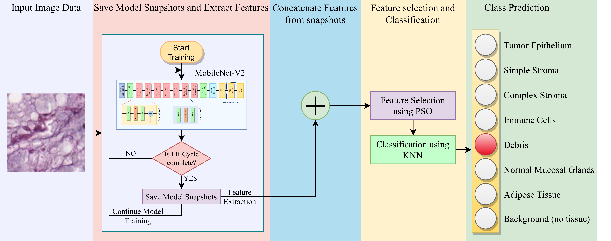

# Snapshot-Ensemble-Colorectal-Cancer
Implementation of our paper **[SnapEnsemFS: A Snapshot Ensembling-based Deep Feature Selection Model for Colorectal Cancer Histological Analysis](https://www.nature.com/articles/s41598-023-36921-8)** published in **_Scientific Reports_, Nature (2023).**

## Overall Workflow


## Requirements
To install the required dependencies run the following in command prompt:
`pip install -r requirements.txt`

## Running the codes:
Required directory structure:

```

+-- data
|   +-- .
|   +-- train
|   +-- val
+-- PSO.py
+-- __init__.py
+-- main.py
+-- model.py

```
Then, run the code using the command prompt as follows:

`python main.py --data_directory "data"`

Available arguments:
- `--epochs`: Number of epochs of training. Default = 100
- `--learning_rate`: Learning Rate. Default = 0.0002
- `--batch_size`: Batch Size. Default = 4
- `--momentum`: Momentum. Default = 0.9
- `--num_cycles`: Number of cycles. Default = 5

## Citation
If you find our paper useful for your research, consider citing us:
```
@article{chattopadhyay2023snapensemfs,
  title={SnapEnsemFS: a snapshot ensembling-based deep feature selection model for colorectal cancer histological analysis},
  author={Chattopadhyay, Soumitri and Singh, Pawan Kumar and Ijaz, Muhammad Fazal and Kim, SeongKi and Sarkar, Ram},
  journal={Scientific Reports},
  volume={13},
  number={1},
  pages={9937},
  year={2023},
  publisher={Nature Publishing Group UK London}
}
```
